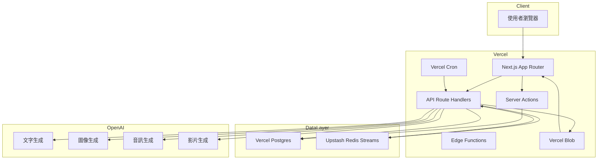
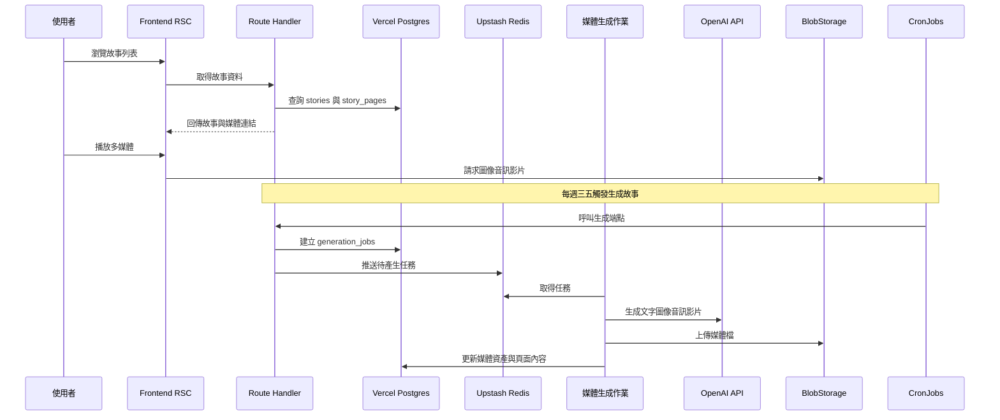
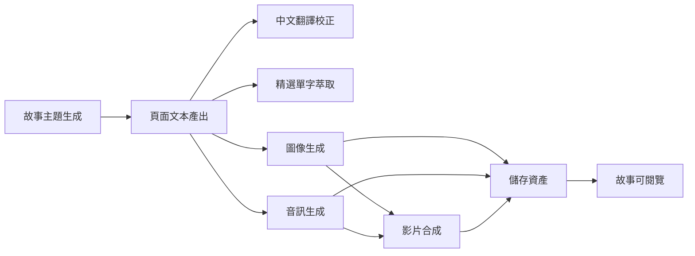
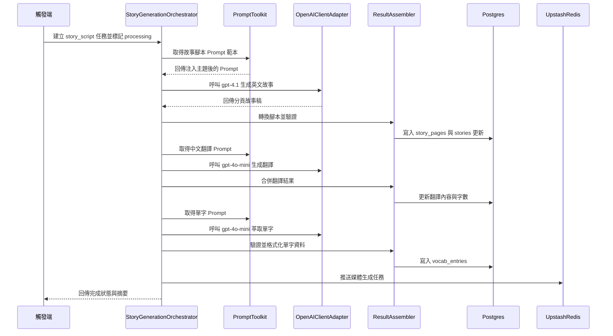

# 0-6 歲英文故事繪本網站系統設計規格書

## 1. 簡介
- **目標**：建立一個能自動生成故事內容、配套圖像、音訊、影片的互動式英文繪本平台，並提供精選單字學習。
- **主要技術棧**：Next.js 15 App Router、React Server Components、Node.js 22、Vercel Serverless/Edge Functions、Vercel Cron、Vercel Postgres、Upstash Redis、OpenAI API。
- **部署策略**：前後端統一部署於 Vercel，善用 App Router 與 Server Actions，符合 [`.roo/rules/rule.md`](.roo/rules/rule.md) 指南。

## 2. 需求摘要
1. 每篇故事 10 頁、每頁 50 字以內，附中文翻譯。
2. 系統自動生成圖、音訊、影片資產。
3. 每週三與週五自動生成兩篇故事。
4. 每篇故事提供精選十單字功能。
5. 儲存於 Vercel Postgres，排程採 Vercel Cron，佇列採 Upstash Redis。
6. 前端需支援響應式閱讀體驗與多媒體播放。

## 3. 系統整體架構

## 4. 數據流程

## 5. 模組與服務說明
### 5.1 前端（Next.js App Router）
- 採用 React Server Components 提供列表與頁面內容 SSR。
- 利用 Server Actions 處理故事收藏、單字標記、使用者回饋。
- 使用 Next.js Image 與自適應播放器播放圖像音訊影片。
- Metadata API 生成 SEO 與社群分享資訊。
- Parallel routes 用於併行載入故事內容與單字列表。
- Intercepting routes 用於顯示精選單字 modal。

### 5.2 BFF / API 層
- Route Handlers 提供 RESTful 端點：故事清單、單篇故事、精選單字、媒體狀態、任務狀態。
- Server Actions 供管理端觸發重生成、修訂內容。
- Edge Functions 提供低延遲快取與地區化內容。

### 5.3 排程與佇列
- Vercel Cron：週三與週五各執行一次，依據 `weekly_schedule` 推送兩篇故事生成任務。
- Upstash Redis Streams：儲存 `generation_jobs` 佇列，支援 retry 與 dead letter stream。
- 媒體生成 Worker：可部署於 Vercel Serverless Functions 或外部 Node 服務，透過 Redis Streams 消費任務。

#### Upstash 推送 (行為、環境變數與測試)
- 支援的環境變數（優先順序與說明）：
  - `UPSTASH_REDIS_URL`：若設定，系統會優先採用 Redis client（使用 ioredis）連接 Upstash，直接以 RPUSH 將每個 message（JSON string）追加至 list queue。
  - `UPSTASH_REST_URL` 與 `UPSTASH_REST_TOKEN`：若未設定 `UPSTASH_REDIS_URL`，會回退到 REST API 推送，發送 POST 到 `UPSTASH_REST_URL`，Authorization: `Bearer ${UPSTASH_REST_TOKEN}`，body 範例：`{ "queue": "<queue_name>", "messages": ["...", "..."] }`。
  - `UPSTASH_QUEUE_NAME`：佇列名稱，預設為 `generation_jobs`。
- 實作細節：
  - 為了避免強制安裝依賴或在非需要環境造成錯誤，Redis client (ioredis) 透過動態 import(`ioredis`) 使用。若 import 或 client push 失敗，會嘗試 REST 回退。
  - 使用 RPUSH 向 list 佇列追加每一則訊息；訊息結構為 `JSON.stringify({ jobId: <id>, timestamp: <ms> })`。
  - push 操作應為可重試的外部推送；若推送失敗，Orchestrator/OrchestrationPersistence 會記錄於 `failed_jobs` 並由 ErrorHandler 處理通知（如設定 Slack）。
- 安全與部署注意事項：
  - 在生產環境應在 Vercel / 部署平台安全地設定 `UPSTASH_REDIS_URL` 或 `UPSTASH_REST_TOKEN`。
  - 若同時設定 Redis 與 REST 參數，會以 `UPSTASH_REDIS_URL` 為優先。
- 測試與驗證：
  - 已新增單元測試覆蓋 Upstash 推送行為（位置：`web/test/upstash.test.ts`），包含：
    - 當 `UPSTASH_REDIS_URL` 設定時，mock `ioredis` client 的 `rpush` 呼叫並驗證會對應的 queue 與 message shape。
    - 當未設定 `UPSTASH_REDIS_URL` 但設定 `UPSTASH_REST_URL`/`UPSTASH_REST_TOKEN` 時，mock `fetch` 驗證 REST 推送內容（headers、body 與 messages 數量）。
  - 測試採用 `vi.resetModules()` 與動態 import，以確保 `env` 與 `ioredis` mock 在 import 時生效，並避免污染全域測試狀態。
- 建議驗收標準：
  - 在 staging 環境啟用 `UPSTASH_REDIS_URL`，執行一個小量任務並確認 Upstash list queue 增加對應訊息。
  - 若無法使用 Redis client，REST push 成功且回傳狀態為 200。

### 5.4 媒體生成管線
1. Story Idea 生成：OpenAI GPT4o 產生 10 個情境。
2. Story Script：GPT4o 依情境生成 10 頁英文稿，附中文翻譯。
3. Vocabulary Extraction：LLM 擷取十組關鍵單字與解釋，儲存 `vocab_entries`。
4. Image Generation：DALL·E 基於頁面內容生成圖像，儲存於 Blob Storage。
5. Audio Narration：OpenAI Audio API 生成英文旁白與中文翻譯語音。
6. Video Montage：OpenAI Video API 或外部服務將頁面圖像與音訊組合為影片。
7. Asset Persistence：更新 `media_assets` 與 `story_pages` 連結。

### 5.5 使用者體驗
- 故事列表：依主題、年齡、最近發佈排序。
- 閱讀頁：支援逐頁切換、英文與中文並列、播放音訊、觀看影片。
- 精選單字：顯示單字、詞性、英文例句、中文解釋，可加入個人單字本。
- 家長後台：查看排程、故事狀態、媒體生成紀錄。

### 5.6 OpenAI 文字生成模組
- **StoryGenerationOrchestrator**：負責協調故事腳本、翻譯、單字任務；由 Route Handler 或 Cron 觸發，建立 `generation_jobs`，依序呼叫 PromptToolkit 與 OpenAIClientAdapter。
- **PromptToolkit**：維護多階段 Prompt 範本（構想、腳本、翻譯、單字），統一語氣、長度與安全指引，並注入故事主題與頁面約束。
- **OpenAIClientAdapter**：封裝 OpenAI SDK（Retries、超時、速率限制、日誌），輸出標準化回傳結構並記錄 token 用量。
- **ResultAssembler**：解析模型輸出並轉換為 `story_pages`、`vocab_entries` 可用資料，計算字數與媒體占位資訊。
- **ErrorHandler**：接手錯誤與驗證失敗，更新 `generation_jobs` 狀態、累加 `retry_count`，必要時寫入 `failed_jobs` 與觸發通知。

- **輸入契約**：`generation_jobs.payload` 需包含故事主題、目標年齡層、語氣設定、既有故事 ID（重生任務時）。
- **輸出契約**：寫入 `stories` 更新標題與摘要、寫入 `story_pages` 10 頁內容與翻譯、寫入 `vocab_entries` 十組單字資料，並為後續媒體生成留下 placeholder metadata。
- **狀態轉換**：Orchestrator 起始將任務設為 `processing`，成功後標記 `completed` 並觸發媒體任務；錯誤時記錄 `failure_reason`，超過重試閾值轉入 `failed`。
- **外部依賴**：依賴環境變數管理的 OpenAI API Key、[`web/db/client.ts`](web/db/client.ts:1) 的 Postgres 連線、Upstash Redis 佇列進行下一階段媒體任務推送。
## 6. 排程與重試策略
#### 5.6.1 Prompt 策略與模型選擇
- **模型層級**：
  - 故事腳本：`gpt-4.1` 主模型，若成本受限則降為 `gpt-4o-mini`，確保具備多段輸出穩定性。
  - 中文翻譯：優先使用 `gpt-4o-mini`，需求為語意準確與孩童易懂，保留 `gpt-4.1` 為回退。
  - 精選單字：`gpt-4o-mini` 擅長結構化輸出，限制為 JSON Schema 產出十組單字。
- **Prompt 模板**：
  - 故事腳本：系統訊息鎖定目標族群（0-6 歲）、每頁字數上限、語氣與多樣化角色；包含 JSON 結構回傳每頁 `page_number`、`text_en`、`summary_en`。
  - 中文翻譯：要求對應頁碼逐項翻譯，輸出 `text_zh`、`notes_zh`，並維持字面忠實避免成人語彙。
  - 精選單字：指定輸出 `word`、`part_of_speech`、`definition_en`、`definition_zh`、`example_sentence`、`example_translation`，同時給出 CEFR 等級。
- **上下文注入**：傳遞故事主題、年齡層、語氣、現有角色設定與前一階段輸出摘要，避免風格飄移。
- **安全與合規**：預先在 Prompt 加入安全守則（避免暴力、恐怖、成人內容），遇到觸發時回傳安全錯誤碼，由 ErrorHandler 轉入人工審核。
- **輸出驗證**：ResultAssembler 透過 Zod schema 驗證 JSON 結構，若失敗即重新提示模型僅返回 JSON。
#### 5.6.2 文字生成管線流程圖

- **流程說明**：從觸發端（Vercel Cron 或後台 Server Action）啟動，Orchestrator 依序生成腳本、翻譯、單字，並於每步透過 PromptToolkit 注入一致語境，最後由 ResultAssembler 驗證結構後寫回資料庫與佇列。
- **監控節點**：Orchestrator 於每個階段記錄 OpenAI token 用量，Sentry 監聽 Prompt 或解析失敗；Upstash Redis 監控媒體任務佇列深度。
- **延伸彈性**：若需增添校對或安全審核步驟，可在 Orchestrator 與 Queue 之間插入額外 generation_jobs 類型而不影響主流程。
#### 8.1 文字生成專用 API 與 Server Action（非同步優先設計）
- 設計原則：為避免在 HTTP 請求中同步執行大量模型呼叫（長時間阻塞、超時與高額成本），建議以「立即建立 generation_jobs 並回傳 job id」的非同步流程為主，將實際的文字生成工作交由 worker（非同步消費者）處理。
- API 與行為：
  - **POST /api/generation/trigger**（管理端 / Cron 呼叫）
    - 功能：接收故事主題 / storyId / 排程資訊，建立一或多個 `generation_jobs`（job_type 範例：`story_script`）；回傳新建立的 job id 列表與基本排程記錄。
    - 回傳範例：{ ok: true, jobIds: ["<uuid>","..."], storyId: "<id>" }
    - 實作參考：請參考路由實作樣板 [`web/app/api/generation/story-script/route.ts`](web/app/api/generation/story-script/route.ts:1)（需改為建立 job 而非同步執行生成）。
  - **POST /api/generation/retry**：管理端重試指定 `generation_job_id`，Server Action 驗證權限後重新推入佇列並重置狀態（保留現有行為）。
  - **GET /api/generation/jobs/:storyId**：查詢故事相關所有文字任務狀態，供前端顯示進度與管理操作（保留）。
  - **Server Action triggerStoryPipeline**：由排程或後台呼叫；改為建立 `generation_jobs`（story_script、translation、vocabulary 或單一步驟 job），並回傳 job ids。
  - **Server Action approveStory**：在完成翻譯與單字後，由管理者審核發布，更新 `stories.status` 為 `published` 並觸發後續媒體 generation_jobs。
- Job payload contract（generation_jobs.payload 範例，JSONB）
  - story_script job:
    - { "type":"story_script", "storyId":"<id>", "theme":"<theme>", "tone":"warm", "ageRange":"0-6", "scheduledAt":"<iso>" }
  - translation job:
    - { "type":"translation", "storyId":"<id>", "source":"story_script", "pagesContext": <summary|partial> }
  - vocabulary job:
    - { "type":"vocabulary", "storyId":"<id>", "source":"translation" }
- Worker / 消費者契約（worker responsibilities）
  - Worker 從 Upstash list/stream 取得 jobId → 讀取 `generation_jobs` 與對應 payload → 執行相對應 Orchestrator 階段或完整 pipeline → 使用 transaction 寫回 `stories` / `story_pages` / `vocab_entries` / `generation_jobs` 狀態 → 若需要推送更多 jobs（image/audio），由 persistence 層呼叫 `pushJobsToUpstash`。
  - 建議在 worker 中注入可測試的 `StoryGenerationOrchestrator` 與 `OrchestrationPersistence`（參考：[`web/lib/openai/StoryGenerationOrchestrator.ts`](web/lib/openai/StoryGenerationOrchestrator.ts:1) 與 [`web/lib/openai/OrchestrationPersistence.ts`](web/lib/openai/OrchestrationPersistence.ts:1)）。
- 授權與稽核：
  - Route Handler 與 Server Actions 仍依 Auth.js session 驗證角色。
  - 所有重要狀態變更寫入 `audit_logs`，並在 job 建立時記錄 initiator 與來源（cron/manager/ui）。
- Token 控管：
  - 預估每階段 Token 並紀錄於 job context；若超出預算，route/server action 回傳 `ok:false` 並將 job 設為 `blocked_for_cost`（管理者可審核後解鎖或降級模型）。
- 遷移建議（短期）
  - 先將現有同步 route 改為「建立 job 並回傳」的行為（低風險，容易回滾）。
  - 新增一個簡單 worker 範例（放入 [`web/worker/` 目錄]），先實作文字生成 consumer，再逐步加入媒體生成 consumer。
  - 測試策略：單元測試保留 Orchestrator / Persistence 的 mock tests；整合測試在 staging 使用真實 Upstash 設定與受限 OpenAI key 以驗證 E2E 成功率。
- Cron 觸發後建立 `generation_jobs`，狀態 `pending`。
- Worker 消費時轉為 `processing`，若成功更新為 `completed`。
### 10.1 文字生成錯誤處理與監控
- **重試機制**：每個文字生成 `generation_jobs` 預設重試 3 次，採指數退避（30s、2m、5m）。若仍失敗，寫入 `failed_jobs` 並通知 Slack。
- **部分成功策略**：腳本生成成功但翻譯失敗時，保留英文稿並標記 `stories.status = processing_translation`，由 ErrorHandler 僅重試翻譯與單字任務。
- **人工介入流程**：當任務進入 `failed`，後台顯示失敗原因與最後 Prompt，管理者可修改主題或提示後使用 `triggerStoryPipeline` 重跑。
- **監控與日誌**：
  - Sentry 捕捉 API/Server Action 錯誤與模型回應解析失敗。
  - Upstash Redis Stream metrics 監控佇列深度，超過閾值時觸發 PagerDuty/Slack 警報。
  - OpenAI API token 用量每日彙整寫入 `audit_logs` context，供成本追蹤。
- **資料一致性**：所有寫庫操作以交易包覆（Drizzle transaction），確保故事與頁面同步更新；若上傳 Blob 失敗則回滾。
- **備援**：若 OpenAI API 回傳 429/5xx，OpenAIClientAdapter 切換至備援模型或暫停並回報，避免無限重試。
- 失敗時遞增 retry 次數，未達閾值時重新推入佇列；超過閾值寫入 `failed_jobs` 並通知維運。
- 產生流程中途失敗時，保持部分資產草稿狀態，透過 Server Actions 手動重跑。

## 7. 資料庫設計（Vercel Postgres）
| Table | Fields | 說明 |
| --- | --- | --- |
| `users` | `id` PK, `email`, `role`, `created_at` | 家長與管理者帳號 |
| `stories` | `id` PK, `title_en`, `title_zh`, `theme`, `status`, `scheduled_at`, `published_at`, `age_range`, `created_by`, `metadata` JSONB | 故事基本資料與狀態 |
| `story_pages` | `id` PK, `story_id` FK, `page_number`, `text_en`, `text_zh`, `word_count`, `media_asset_id` FK, `audio_asset_id` FK | 每頁內容與媒體連結 |
| `media_assets` | `id` PK, `story_id` FK, `page_id` nullable, `type`, `uri`, `format`, `duration`, `metadata` JSONB, `generation_job_id` FK | 圖像、音訊、影片檔案資訊 |
| `vocab_entries` | `id` PK, `story_id` FK, `word`, `part_of_speech`, `definition_en`, `definition_zh`, `example_sentence`, `example_translation` | 精選單字資料 |
| `generation_jobs` | `id` PK, `story_id` FK, `job_type`, `status`, `retry_count`, `payload` JSONB, `created_at`, `updated_at` | 任務佇列狀態 |
| `weekly_schedule` | `id` PK, `scheduled_date`, `story_count`, `status`, `notes` | 排程設定 |
| `failed_jobs` | `id` PK, `generation_job_id` FK, `error_code`, `error_message`, `resolved`, `created_at` | 失敗追蹤 |
| `audit_logs` | `id` PK, `user_id` FK, `action`, `context` JSONB, `created_at` | 操作記錄 |

## 8. API 與 Server Actions 規劃
- `GET /api/stories`: 分頁取得故事摘要。
- `GET /api/stories/{id}`: 取得故事全文與媒體連結。
- `GET /api/stories/{id}/vocab`: 取得精選單字。
- `POST /api/generation/trigger`: 管理端手動觸發生成（需權限）。
- `GET /api/generation/jobs`: 查詢任務狀態。
- `POST server actions`: 加入單字收藏、回報內容問題、重新發布故事。
- 所有敏感操作採 Server Actions，避免暴露 API 金鑰於前端。

## 9. 媒體儲存策略
- 圖像、音訊、影片檔案放於 Vercel Blob 或 S3 相容儲存，URI 寫入 `media_assets`。
- 靜態縮圖於 Next.js Image 服務中自動壓縮。
- 影片支援串流播放，meta 資訊存 JSONB 以利擴充。

## 10. 安全與監控
- 使用 Vercel 環境變數管理 OpenAI 金鑰與資料庫連線。
- 導入 Sentry 監控前後端異常，並加上排程失敗通知（Email 或 Slack Webhook）。
- 實作 Rate limiting 於 API，防止濫用。

## 11. 擴充考量
- 若 OpenAI 影片生成功能不足，可整合外部服務（如 Runway）透過 Webhook 回寫。
- 支援多語系時，可擴充 `story_pages` JSONB 儲存多語版本。
- 若故事量增大，可考慮將媒體生成 Worker 部署於專用 GPU 服務。

## 12. 里程碑與輸出
1. 資料庫 schema 與 ORM 初始化。
2. 故事生成服務與 OpenAI 整合。
3. 媒體生成與佇列機制。
4. 前端故事閱讀介面、單字功能。
5. 排程自動化與監控。
6. 上線驗收與教學文件。
## 暫時 DB persistence 決策（2025-11-12）

背景
- 發現使用 Drizzle + `@vercel/postgres` 執行 transaction 時在 BEGIN 階段失敗（錯誤訊息："Failed query: begin"；底層 debug 指向嘗試以 HTTPS/WS 連到本機 443 埠並被拒絕，導致 `NeonDbError: fetch failed` / ECONNREFUSED）。
- 原生 `pg` client（TCP）在本機環境可正常連線並執行 INSERT/COMMIT。

短期決策（採用）
- 為快速恢復系統穩定性，決定在 persistence 層採用原生 `pg` client 作為 fallback，並已在開發分支實作與 commit。
  - 變更檔案：[`web/lib/openai/OrchestrationPersistence.ts`](web/lib/openai/OrchestrationPersistence.ts:1)
  - Commit 訊息： "feat: use pg client fallback for persistence to avoid vercel-postgres transaction issue"（commit id: 08a515e 在本地 repo）
- 已驗證：透過開發伺服器呼叫 API（POST /api/generation/story-script）可成功寫入資料庫（回傳 200 並產生 createdJobIds）。

重現與偵錯資源（已建立）
- Drizzle transaction 重現腳本：[`web/scripts/drizzle_test.js`](web/scripts/drizzle_test.js:1)
- `@vercel/postgres` 最小測試：[`web/scripts/vercel_pg_test.js`](web/scripts/vercel_pg_test.js:1)
- 原生 pg 測試（連線驗證）：[`web/scripts/pgtest.js`](web/scripts/pgtest.js:1)
- 已收集的 debug log（包含使用 `NODE_DEBUG=net,ws` 的輸出）已記錄於報告：[`report.md`](report.md:1)

中期 / 後續行動（建議）
1. 在 CI / staging 上保留 pg fallback（已 commit），確保整套流程在整合環境穩定運作；觀察 1-2 個 release cycle 後再決定是否恢復 Drizzle transaction。  
2. 於乾淨環境（或 CI runner）重現 Drizzle / `@vercel/postgres` 問題，檢驗以下變項：
   - 環境變數（DATABASE_URL / POSTGRES_URL）在不同執行環境的行為差異。  
   - `@vercel/postgres` 與 `drizzle-orm` 版本組合是否導致 client 使用 serverless/fetch/WS 路徑（Neon-style）。  
   - 嘗試強制或配置使 `@vercel/postgres` 使用 TCP 連線（若支援），或回退至不同版本。  
3. 若在中期追查後仍存在不明原因，整理 issue-ready report（包含重現步驟與 debug log）提交至 upstream（Drizzle / @vercel/postgres / Neon），並在 repo 中建立追蹤 issue。

文件 / 追蹤
- 本決策已記錄於本段（spec.md），並已把詳細調查結果 append 至 [`report.md`](report.md:1)。
- 待辦（已在 `todolist.md` 與任務管理中更新）：
  - [ ] 在 CI 上重現 Drizzle 問題並收集 log  
  - [ ] 嘗試不同版本組合或 client 設定以強制 TCP 連線  
  - [ ] 若需要，整理 issue 並提交給 upstream

負責人與權限
- 短期：保留 pg fallback（由目前負責開發的工程師維護）  
- 中期：由專責工程師負責在 CI/乾淨環境中追查並提交 upstream（必要時請求協助）

範例檢索（快速連結）
- 修補程式碼：[`web/lib/openai/OrchestrationPersistence.ts`](web/lib/openai/OrchestrationPersistence.ts:1)  
- 重現腳本：[`web/scripts/drizzle_test.js`](web/scripts/drizzle_test.js:1), [`web/scripts/vercel_pg_test.js`](web/scripts/vercel_pg_test.js:1), [`web/scripts/pgtest.js`](web/scripts/pgtest.js:1)  
- 調查報告：[`report.md`](report.md:1)
