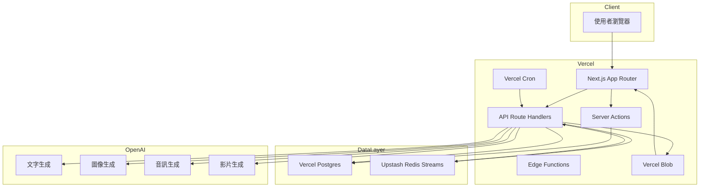
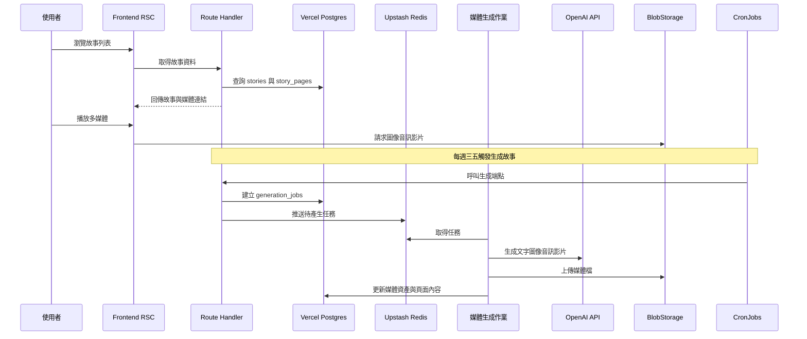
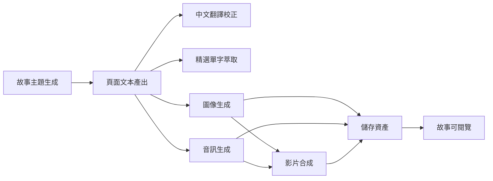

# 0-6 歲英文故事繪本網站系統設計規格書

## 1. 簡介
- **目標**：建立一個能自動生成故事內容、配套圖像、音訊、影片的互動式英文繪本平台，並提供精選單字學習。
- **主要技術棧**：Next.js 15 App Router、React Server Components、Node.js 22、Vercel Serverless/Edge Functions、Vercel Cron、Vercel Postgres、Upstash Redis、OpenAI API。
- **部署策略**：前後端統一部署於 Vercel，善用 App Router 與 Server Actions，符合 [`.roo/rules/rule.md`](.roo/rules/rule.md) 指南。

## 2. 需求摘要
1. 每篇故事 10 頁、每頁 50 字以內，附中文翻譯。
2. 系統自動生成圖、音訊、影片資產。
3. 每週三與週五自動生成兩篇故事。
4. 每篇故事提供精選十單字功能。
5. 儲存於 Vercel Postgres，排程採 Vercel Cron，佇列採 Upstash Redis。
6. 前端需支援響應式閱讀體驗與多媒體播放。

## 3. 系統整體架構

## 4. 數據流程

## 5. 模組與服務說明
### 5.1 前端（Next.js App Router）
- 採用 React Server Components 提供列表與頁面內容 SSR。
- 利用 Server Actions 處理故事收藏、單字標記、使用者回饋。
- 使用 Next.js Image 與自適應播放器播放圖像音訊影片。
- Metadata API 生成 SEO 與社群分享資訊。
- Parallel routes 用於併行載入故事內容與單字列表。
- Intercepting routes 用於顯示精選單字 modal。

### 5.2 BFF / API 層
- Route Handlers 提供 RESTful 端點：故事清單、單篇故事、精選單字、媒體狀態、任務狀態。
- Server Actions 供管理端觸發重生成、修訂內容。
- Edge Functions 提供低延遲快取與地區化內容。

### 5.3 排程與佇列
- Vercel Cron：週三與週五各執行一次，依據 `weekly_schedule` 推送兩篇故事生成任務。
- Upstash Redis Streams：儲存 `generation_jobs` 佇列，支援 retry 與 dead letter stream。
- 媒體生成 Worker：可部署於 Vercel Serverless Functions 或外部 Node 服務，透過 Redis Streams 消費任務。

### 5.4 媒體生成管線
1. Story Idea 生成：OpenAI GPT4o 產生 10 個情境。
2. Story Script：GPT4o 依情境生成 10 頁英文稿，附中文翻譯。
3. Vocabulary Extraction：LLM 擷取十組關鍵單字與解釋，儲存 `vocab_entries`。
4. Image Generation：DALL·E 基於頁面內容生成圖像，儲存於 Blob Storage。
5. Audio Narration：OpenAI Audio API 生成英文旁白與中文翻譯語音。
6. Video Montage：OpenAI Video API 或外部服務將頁面圖像與音訊組合為影片。
7. Asset Persistence：更新 `media_assets` 與 `story_pages` 連結。

### 5.5 使用者體驗
- 故事列表：依主題、年齡、最近發佈排序。
- 閱讀頁：支援逐頁切換、英文與中文並列、播放音訊、觀看影片。
- 精選單字：顯示單字、詞性、英文例句、中文解釋，可加入個人單字本。
- 家長後台：查看排程、故事狀態、媒體生成紀錄。

## 6. 排程與重試策略
- Cron 觸發後建立 `generation_jobs`，狀態 `pending`。
- Worker 消費時轉為 `processing`，若成功更新為 `completed`。
- 失敗時遞增 retry 次數，未達閾值時重新推入佇列；超過閾值寫入 `failed_jobs` 並通知維運。
- 產生流程中途失敗時，保持部分資產草稿狀態，透過 Server Actions 手動重跑。

## 7. 資料庫設計（Vercel Postgres）
| Table | Fields | 說明 |
| --- | --- | --- |
| `users` | `id` PK, `email`, `role`, `created_at` | 家長與管理者帳號 |
| `stories` | `id` PK, `title_en`, `title_zh`, `theme`, `status`, `scheduled_at`, `published_at`, `age_range`, `created_by`, `metadata` JSONB | 故事基本資料與狀態 |
| `story_pages` | `id` PK, `story_id` FK, `page_number`, `text_en`, `text_zh`, `word_count`, `media_asset_id` FK, `audio_asset_id` FK | 每頁內容與媒體連結 |
| `media_assets` | `id` PK, `story_id` FK, `page_id` nullable, `type`, `uri`, `format`, `duration`, `metadata` JSONB, `generation_job_id` FK | 圖像、音訊、影片檔案資訊 |
| `vocab_entries` | `id` PK, `story_id` FK, `word`, `part_of_speech`, `definition_en`, `definition_zh`, `example_sentence`, `example_translation` | 精選單字資料 |
| `generation_jobs` | `id` PK, `story_id` FK, `job_type`, `status`, `retry_count`, `payload` JSONB, `created_at`, `updated_at` | 任務佇列狀態 |
| `weekly_schedule` | `id` PK, `scheduled_date`, `story_count`, `status`, `notes` | 排程設定 |
| `failed_jobs` | `id` PK, `generation_job_id` FK, `error_code`, `error_message`, `resolved`, `created_at` | 失敗追蹤 |
| `audit_logs` | `id` PK, `user_id` FK, `action`, `context` JSONB, `created_at` | 操作記錄 |

## 8. API 與 Server Actions 規劃
- `GET /api/stories`: 分頁取得故事摘要。
- `GET /api/stories/{id}`: 取得故事全文與媒體連結。
- `GET /api/stories/{id}/vocab`: 取得精選單字。
- `POST /api/generation/trigger`: 管理端手動觸發生成（需權限）。
- `GET /api/generation/jobs`: 查詢任務狀態。
- `POST server actions`: 加入單字收藏、回報內容問題、重新發布故事。
- 所有敏感操作採 Server Actions，避免暴露 API 金鑰於前端。

## 9. 媒體儲存策略
- 圖像、音訊、影片檔案放於 Vercel Blob 或 S3 相容儲存，URI 寫入 `media_assets`。
- 靜態縮圖於 Next.js Image 服務中自動壓縮。
- 影片支援串流播放，meta 資訊存 JSONB 以利擴充。

## 10. 安全與監控
- 使用 Vercel 環境變數管理 OpenAI 金鑰與資料庫連線。
- 導入 Sentry 監控前後端異常，並加上排程失敗通知（Email 或 Slack Webhook）。
- 實作 Rate limiting 於 API，防止濫用。

## 11. 擴充考量
- 若 OpenAI 影片生成功能不足，可整合外部服務（如 Runway）透過 Webhook 回寫。
- 支援多語系時，可擴充 `story_pages` JSONB 儲存多語版本。
- 若故事量增大，可考慮將媒體生成 Worker 部署於專用 GPU 服務。

## 12. 里程碑與輸出
1. 資料庫 schema 與 ORM 初始化。
2. 故事生成服務與 OpenAI 整合。
3. 媒體生成與佇列機制。
4. 前端故事閱讀介面、單字功能。
5. 排程自動化與監控。
6. 上線驗收與教學文件。